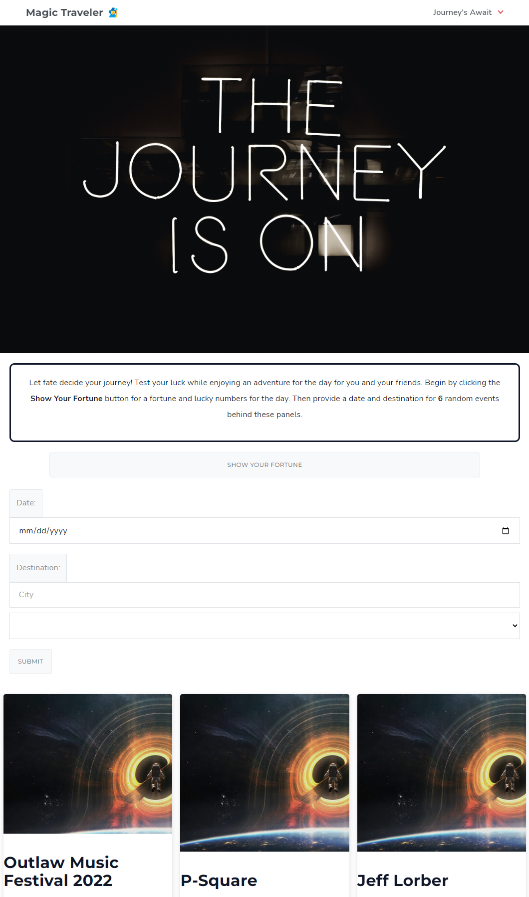

# Magic Traveler
## About

We are building Server-Side APIs from Digital Fortune and Google Events. When you Visit Magic Traveler you experience an adventure of a random place.

As A Hodophile I Want to explore new places so that I can find interesting facts to the journey.

Given a dashboard of different events, WHEN I search for a city, I will see parameters of 6 hidden doors, it will THEN presented me with 6 random list of events availible on that date in the Google Events Website.This process the magic which you will choose a lucky number to and enjoy a random adventure.

## Made With

* jQuery
* Cirrus
* javascript
* html5
* css

### APIs

* Digital Fortune- Organizer/Lucky Numbers
* Google Events- Maps/locater/routing

## Live Page
Deployed page: https://plovato97.github.io/Magic-trav/

## Image

## Warnings

BEFORE CLICKING ON DEPLOYED SITE, please click on https://cors-anywhere.herokuapp.com/corsdemo for temporary CORS access in order for webpage to work. We've decided that for future development, we could get it to work without the CORS. However, we were told to continue the project because of how much we had put into our site.